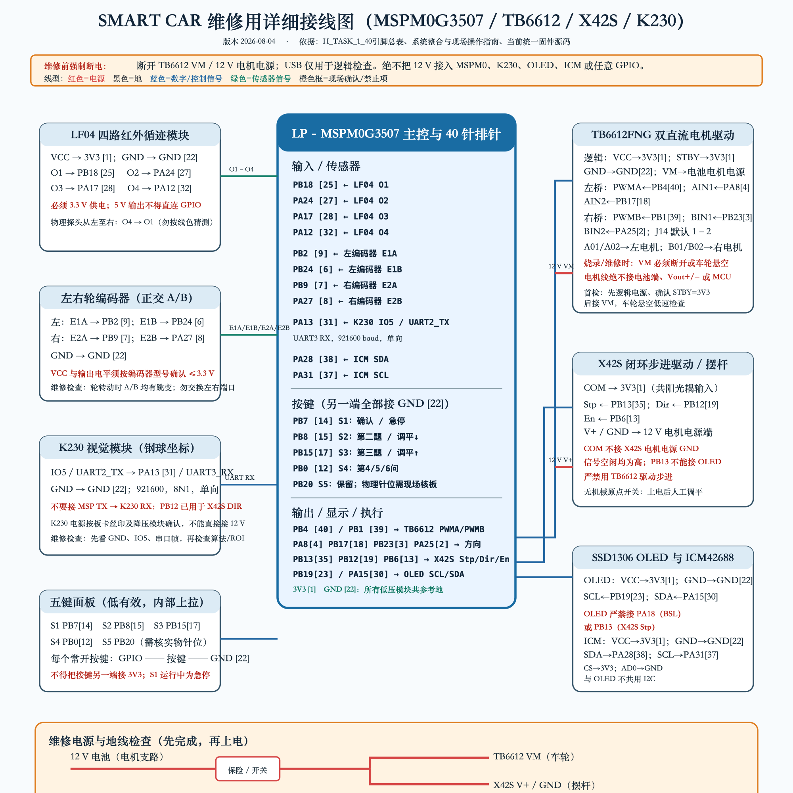
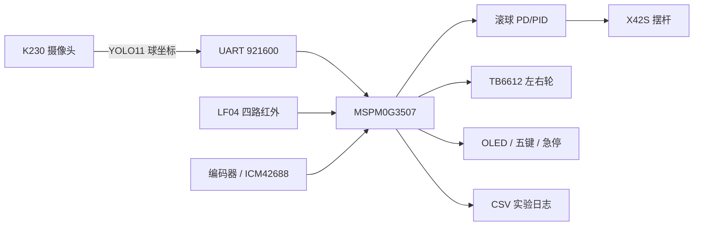

# 2026 电赛 H 题｜车载平衡滚球运动控制系统（省三方案参考）


[](https://github.com/AKO-J/2026-NUEDC-H-Ball-Beam-Car/stargazers)

> 2026 年全国大学生电子设计竞赛赛区赛暨 TI 杯模拟电子系统设计专题赛，H 题「车载平衡滚球运动控制系统」开源方案。最终获得赛区三等奖（省三）。

[官方赛题页面](https://res.nuedc-training.com.cn/topic/2026/topic_140.html) · [结题复盘](PROJECT_CLOSURE.md) · [系统架构](CORE_DOCS/SYSTEM_ARCHITECTURE.md) · [接线与安全](CORE_DOCS/OPERATIONS_AND_SAFETY.md) · [实验记录](EXPERIMENTS.md)

如果这个项目帮你少踩了一个坑，欢迎点一个 ⭐ Star。也欢迎在 Issue 里交流 K230、MSPM0、滚球 PID/PD、循迹和步进机构问题。



## 这份方案有什么

- K230 + YOLO11 钢球检测，UART 向 MSPM0G3507 发送球位置。
- X42S 闭环步进驱动摆杆，完成调平、位置微调和滚球控制。
- LF04 四路红外循迹、TB6612 双电机、编码器和 ICM42688。
- OLED + 五键任务选择，统一入口接入第二题、第三题和第 4/5/6 问。
- 第三题赛前通过样本、联合控制对比实验、CSV/meta、分析图和安全检查工具。
- 完整赛后复盘：不仅公开成功参数，也保留机械结构失效和现场调试失败的原因。

## 方案总览

| 模块 | 方案 |
| --- | --- |
| 视觉 | K230、YOLO11、ROI、钢球 X 坐标 |
| 主控 | TI MSPM0G3507 |
| 摆杆 | X42S 闭环步进驱动，STEP/DIR/EN |
| 小球控制 | α-β 状态估计 + PD/PID 边界控制 |
| 小车循迹 | LF04 四路红外 + 双路编码器 |
| 电机驱动 | TB6612FNG |
| 姿态与显示 | ICM42688 + SSD1306 OLED |
| 日志 | XDS110 UART → CSV/meta → Python 分析/评分 |



## 可追溯结果

| 项目 | 结论 | 证据 |
| --- | --- | --- |
| 第三题 `0→+5→-5 cm` | 赛前单次实机完成约 1.75 s，无丢球/估算丢帧 | [`run_20260801_123833.csv`](motor_forward_test/logs/run_20260801_123833.csv) 与[分析图](motor_forward_test/analysis/run_20260801_123833_analysis.png) |
| 联合静态回中 | Kp=11 的记录可用；Kp=12、14 回摆明显，未采用 | [`EXPERIMENTS.md`](EXPERIMENTS.md) |
| 统一固件 | 2026-09-05 重新构建和主机回归通过 | [`competition_selector_main.c`](motor_forward_test/competition_selector_main.c) |
| 最终比赛 | 赛区三等奖；第三题现场未稳定完成 | [`PROJECT_CLOSURE.md`](PROJECT_CLOSURE.md) |

> 注意：赛前分项通过不等于比赛现场全部通过。现场支撑球杆机构的热熔胶松动，机械基准发生变化；同时 5° 微调过粗，有限时间内无法重新完成结构修复、标定和 PID 调整。这个失败边界对复现者比一组“神奇参数”更重要。

## 核心代码入口

- 统一任务入口：[`competition_selector_main.c`](motor_forward_test/competition_selector_main.c)
- 小球控制器：[`ball_beam_controller.c`](motor_forward_test/ball_beam_controller.c)
- 第三题序列：[`ball_beam_vision_control_test.c`](motor_forward_test/tests/bringup/ball_beam_vision_control_test.c)
- 联合控制：[`joint_line_balance_test.c`](motor_forward_test/tests/bringup/joint_line_balance_test.c)
- 步进接口：[`stepper_beam.c`](motor_forward_test/stepper_beam.c)
- K230 视觉：[`steel_ball_uart_yolo.py`](motor_forward_test/k230/steel_ball_uart_yolo.py)
- 日志分析：[`tools/`](motor_forward_test/tools/)
- 完整引脚表：[`H_TASK_1_40引脚总表.md`](motor_forward_test/H_TASK_1_40引脚总表.md)

## 快速开始

需要 TI MSPM0 SDK 2.11.00.07 和 TI Arm Clang 4.0.2.LTS。SDK、编译器和烧录器不包含在仓库中。

```bash
git clone https://github.com/AKO-J/2026-NUEDC-H-Ball-Beam-Car.git
cd 2026-NUEDC-H-Ball-Beam-Car/motor_forward_test

# 先运行不接触硬件的主机测试
make check-host

# 构建统一比赛固件；替换为你本机的实际路径
make -B competition-unified \
  SDK=/path/to/mspm0_sdk_2_11_00_07 \
  COMPILER=/path/to/ti_cgt_arm_llvm_4.0.2.LTS
```

烧录或驱动电机前，请先阅读[现场操作与安全](/AKO-J/2026-NUEDC-H-Ball-Beam-Car/blob/main/CORE_DOCS/OPERATIONS_AND_SAFETY.md)。必须断开 TB6612 的 VM 或让车轮可靠悬空，并取下钢球。

## 仓库结构

```text
.
├── README.md                   # 本页
├── PROJECT_CLOSURE.md          # 比赛结果与赛后复盘
├── PROJECT_STATUS.md           # 最终状态和证据边界
├── EXPERIMENTS.md              # 关键实验索引
├── CORE_DOCS/                  # 架构、安全、证据说明
├── docs/images/                # 接线图等公开图片
├── motor_forward_test/
│   ├── *.c / *.h / Makefile    # MSPM0 固件
│   ├── k230/                   # K230 脚本、配置和模型
│   ├── tests/                  # 主机测试与 bring-up
│   ├── tools/                  # 日志、分析和评分工具
│   ├── logs/                   # 决定性实验原始数据
│   └── analysis/               # 分析图与摘要
└── releases/                   # 脱敏 ZIP 与 SHA-256
```

## 复用前必读

1. 关键支撑请使用螺钉、夹具、定位销或带机械限位的复合固定，不要只依赖热熔胶。
2. 搬运后重新检查机械零点、回差、端点以及 `-5/0/+5 cm` 三点映射。
3. 旧 PID/PD 参数只能作为参考起点，换结构、镜头或 ROI 后必须重新标定。
4. K230 脚本中的 Wi-Fi 密码已改为 `CHANGE_ME`；默认 `ENABLE_WIFI = False`。
5. “构建通过、主机测试通过、烧录成功、芯片校验成功、架空通过、实物通过”是六个不同层级。

## 开源许可与第三方组件

本仓库以 [GNU AGPL-3.0](LICENSE) 开源。YOLO11 权重及由其转换得到的 K230 模型遵循 Ultralytics 的 AGPL-3.0/企业许可双轨规则，详见 [`THIRD_PARTY_NOTICES.md`](THIRD_PARTY_NOTICES.md)。TI SDK、编译器和厂商工具未随仓库分发。

本项目仅作为 2026 电赛 H 题、省三方案、K230 视觉、MSPM0G3507 控制、X42S 摆杆与滚球 PID/PD 的学习参考，不保证复制硬件或参数即可复现奖项与指标。
