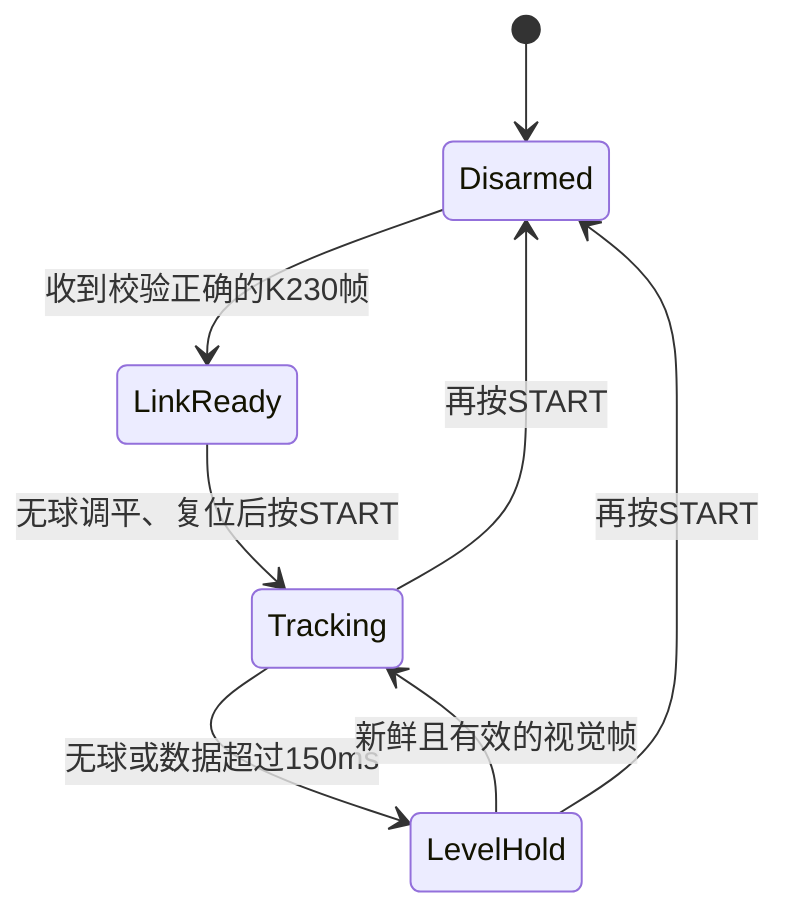

# K230—X42S 小球联动：现状与实施方案

## 1. 结论

软件链路已经具备 K230 视觉坐标 → MSPM0 → X42S → 白杆的完整结构；但**尚未完成硬件闭环验证，当前不能直接放球运行**。

本题的最终任务不是“固定在画面中心”，而是：小车静止时，小球从摆杆中心点 O 运行到 **+5 cm**；到达后折返，运行到 **−5 cm**并稳定；从开始到结束不超过 **5 s**；在 +5 cm 与 −5 cm 两端的最大绝对误差均不超过 **1 cm**。

当前代码中的 `BALL_TARGET_X_PIXEL = 160` 仅是“固定目标”的临时闭环入口，不能单独满足上述任务。必须增加厘米—像素标定和 +5 cm → −5 cm 的轨迹状态机。

最大的硬件阻塞是：此前测得 K230 排针 17（IO5）对 K230 GND 的空闲电平约为 **0 V**。正常启动的 UART TX 应处于空闲高电平。因此在该问题解决、MSPM0 OLED 确认收到数据前，不允许按 START 使能电机。

## 2. 当前 K230 状态

| 项目 | 当前配置/状态 |
|---|---|
| 板卡与相机 | CanMV K230 + OV5647 CSI2（来自交接资料） |
| K230程序 | `k230/steel_ball_uart_yolo.py` |
| 模型 | `k230/models/yolo11n_det_320.kmodel`，2.9 MB |
| SD卡模型路径 | `/sdcard/libs/yolo11n_det_320.kmodel` |
| 模型校验 SHA-256 | `5ba072b31d49e5a8332e39a412c3c793907d0b4b22fee7b9150bf134fc76ee08` |
| 模型输入/输出画面 | 320×180；模型按 320 输入使用 |
| 检测置信度阈值 | 0.32 |
| 水管 ROI | `x=0..271, y=54..101`；ROI 外检测直接丢弃 |
| 检测对象选择 | 只取 ROI 内置信度最高的一个框 |
| K230相机请求 | 320×180 @ 120 FPS；YOLO 每帧推理一次 |
| IDE图像 | 已关闭，`ENABLE_IDE_PREVIEW = False` |
| 控制数据输出 | IO5/UART2_TX，921600 8N1，每个主循环发送一次 |

### 2.1 对“120 FPS”的正确理解

代码已经向相机请求 120 FPS，且循环目标也是 120 FPS；但是实际值必须以 K230 日志的 `capture_loop_fps`、`detect_fps` 为准。当前设置每帧都运行一次 320×320 YOLO，KPU推理时间可能使实际循环低于120 FPS。IDE画面关闭后，第二路取图、绘制和JPEG压缩已经被跳过。

因此：**120 是请求值，不是已经在硬件上确认的实测值。**

### 2.2 类别信息

脚本当前假定类别 0 为 `STEEL BALL`。控制逻辑不依赖显示标签，而是直接选最高分框；但若新模型有多类别且非球类分数更高，需要提供类别表后增加“只接受球类别”的过滤。

## 3. K230 与 MSPM0 的唯一接线

```text
K230 排针17：IO5 / UART2_TX  ───→  MSPM0 排针31：PA13 / UART3_RX
K230 GND                       ───→  MSPM0 GND
```

- 只有 K230 → MSPM0 单向数据线，不接反向 UART。
- **不得接 MSPM0 PB12**：PB12 是 X42S 的 DIR，接入UART会破坏电机方向控制。
- 目前协议为 921600 8N1；线尽量短，必须共地。
- 先断开 PA13 信号线，直接测 K230 IO5 对 K230 GND；运行 K230 串口测试程序后仍为0 V时，先检查排针方向、IO5实际位置、K230脚本是否运行和FPIOA映射。未确认高电平前不要直连电机控制系统。

## 4. 串口协议与数据含义

K230每个控制循环发送：

```text
$BALL,<valid>,<seq>,<x_offset_px>,<confidence_milli>*<XOR>\r\n
```

| 字段 | 含义 |
|---|---|
| `valid` | 1：ROI中找到目标；0：未找到 |
| `seq` | 16位递增序号，用于观察丢帧 |
| `x_offset_px` | `球框中心x - 160`，画面右侧为正 |
| `confidence_milli` | 置信度×1000，例如 487 表示 0.487 |
| `XOR` | `$`与`*`之间所有字符的异或校验 |

MSPM0采用 UART3 中断接收 → 128字节环形缓冲 → XOR校验解析。程序只使用最新完整帧，不积压旧坐标。

## 5. X42S 与白杆：不可违反的标定约束

X42S屏幕显示的是电机轴信息，**不能直接当作白杆角度**。白杆目标角度只能使用以下首版实测表做分段线性插值：

| 白杆角度 | 电机 POS 脉冲 |
|---:|---:|
| −2.221° | −132 |
| −1.333° | −88 |
| −0.444° | −44 |
| 0° | 0 |
| +0.444° | +44 |
| +1.110° | +88 |
| +1.777° | +132 |

- 只允许最终 POS 在 −132～+132。
- 不能外推，也不能用一个统一“脉冲/度”比例。
- 正负两侧斜率不对称，必须保留上述每一段。

例如要求白杆 +1.000°时，程序采用（+0.444°，+44）与（+1.110°，+88），线性插值得到 POS 约 +81。控制程序会记录每次实际使用的两端点和目标POS，供OLED/CCS查看。

## 6. 联动控制代码应如何工作

当前工程已按以下状态机实现，应保持这个结构继续调参：



### 6.1 K230端

1. 取得 AI 图像；
2. YOLO推理；
3. 丢弃中心不在水管 ROI 内的框；
4. 取剩余框中置信度最高者；
5. 算出 `x_offset_px = center_x - 160`；
6. 以921600 UART发送最新帧。

没有检测到球时发送 `valid=0`，而不是发送旧坐标。

### 6.2 MSPM0端

1. 从UART3读取并校验最新帧；
2. 仅接受 `valid=1` 且置信度 ≥0.320 的帧；
3. 若帧距当前时间不超过150 ms，计算球位置误差和速度；
4. 由像素域 PD 输出白杆目标角度；
5. 将白杆角度限制到 −2.221°～+1.777°；
6. 查相邻两个标定点，做线性插值为 POS；
7. 调用 `StepperBeam_setTargetSteps(pos)`。

现有初始参数：目标画面位置为 x=160，比例项 8 mdeg/px，微分项 0.5 mdeg/(px/s)，死区 ±2 px。它们只是第一轮低风险参数，不是最终物理模型。

代码表达式为：

```text
error_px = target_x_offset - measured_x_offset
velocity = filtered(d(x_offset)/dt)
beam_angle = clamp(sign × (Kp × error_px − Kd × velocity))
pos = piecewise_linear_interpolation(beam_angle, calibration_table)
```

`sign` 当前暂定为 `+1`。在无球条件下验证：目标在画面左侧时，白杆应产生能让球向右运动的微小倾角；若实际方向相反，只改 `BALL_CONTROL_SIGN` 为 `-1`，不能调换标定表正负号。

### 6.3 为完成题目必须新增的任务状态机

先固定相机，再测量白杆中心 O 对应的像素 `x0`，以及球沿杆实际移动已知距离时的像素变化，得到 `pixels_per_cm`。保持相机安装、ROI与镜像设置不变后，换算：

```text
x_plus_5_px  = x0 + physical_sign × 5 × pixels_per_cm
x_minus_5_px = x0 - physical_sign × 5 × pixels_per_cm
```

`physical_sign` 必须通过把球轻推向真实右端后观察图像 x 增减来测得，不能仅凭镜像设置猜测。

任务代码应是：

```text
IDLE：                 等待START，记录任务开始时刻
GO_TO_PLUS_5：         目标 = x_plus_5_px
                         |x_cm - 5| <= 1 cm 且连续稳定一小段时间 → 折返
GO_TO_MINUS_5：        目标 = x_minus_5_px
                         |x_cm + 5| <= 1 cm 且连续稳定一小段时间 → PASS/HOLD
PASS/HOLD：            维持 −5 cm，显示总时间和两端最大误差
任一阶段超过5 s：      FAIL，回到已标定POS 0并解除使能
无有效视觉帧>150 ms：  回到已标定POS 0；等待/停机，不可继续计时盲跑
```

这里“到达”不能只凭某一帧进入 ±1 cm；建议要求连续 200 ms 处于 ±1 cm 内，才从 +5 cm 阶段切换到 −5 cm 阶段。记录 `max_error_plus_cm`、`max_error_minus_cm` 和 `total_elapsed_ms`，才可以判断是否满足“≤1 cm、≤5 s”。白杆倾角到电机POS的步骤仍必须使用第5节的分段标定表。

## 7. 安全策略

- 开机默认不使能电机。
- 每次上电必须：取下球 → 白杆调平 → 不动机构复位MSPM0 → 按START接受POS 0。
- START第一次使能前会接受人工零点并安装软件限位 POS −132～+132。
- 视觉无效或150 ms超时：命令**已标定 POS 0**，不保持上一次倾斜；电机仍保持力以维持水平。
- 再按START：停止并解除使能。
- 没有机械限位开关，因此严禁跳过人工零点和软件限位。

## 8. 必须按顺序完成的联调

1. K230模型部署：将工程内模型上传到 `/sdcard/libs/yolo11n_det_320.kmodel`。
2. 保持X42S断使能，运行 `k230/uart_ball_link_test.py`。
3. OLED必须出现 `UART3 RX OK`，并看到XOFF按测试值变化。
4. 若仍是 `UART3 WAIT/TIMEOUT`，先解决 IO5 空闲0 V问题；此时不得按START。
5. 上传并运行 `k230/steel_ball_uart_yolo.py`，验证水管ROI内左右移动时XOFF同向变化。
6. 取下球，完成手动调平/复位流程。
7. 按START，只用很小视觉误差验证倾角方向；发现反向只改 `BALL_CONTROL_SIGN`。
8. 最后才在中心附近放球，并记录稳定时间、超调和最终X误差后调整Kp、Kd。

## 9. 相关代码入口

| 作用 | 文件 |
|---|---|
| K230视觉、ROI、UART发送 | `k230/steel_ball_uart_yolo.py` |
| K230裸UART电气测试 | `k230/uart_ball_link_test.py` |
| MSPM0 UART3接收 | `vision_uart.c` |
| 帧格式与校验 | `vision_ball_protocol.c` |
| 白杆标定插值 | `beam_calibration.c` |
| 像素PD控制 | `ball_beam_controller.c` |
| MSPM0联动测试主程序 | `tests/bringup/ball_beam_vision_control_test.c` |
| X42S脉冲和软件限位 | `stepper_beam.c` |

MSPM0构建/烧录命令：

```bash
cd motor_forward_test
make ball-beam-vision-control-test
make flash-ball-beam-vision-control-test
```
