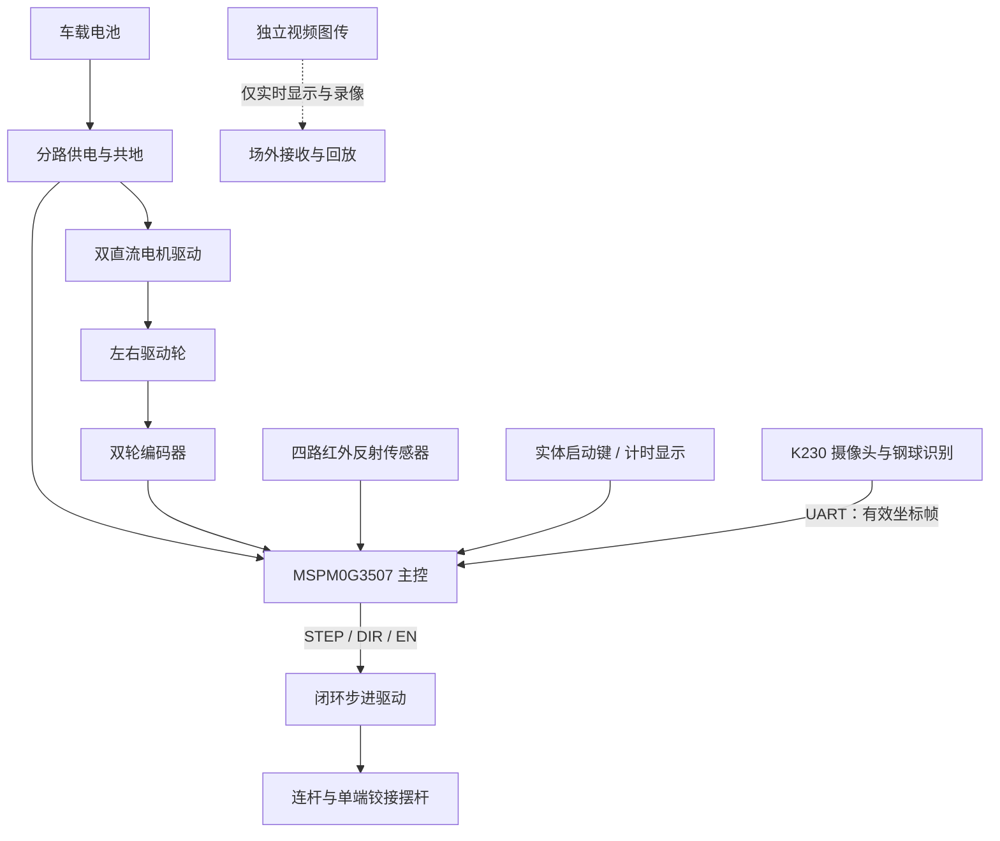
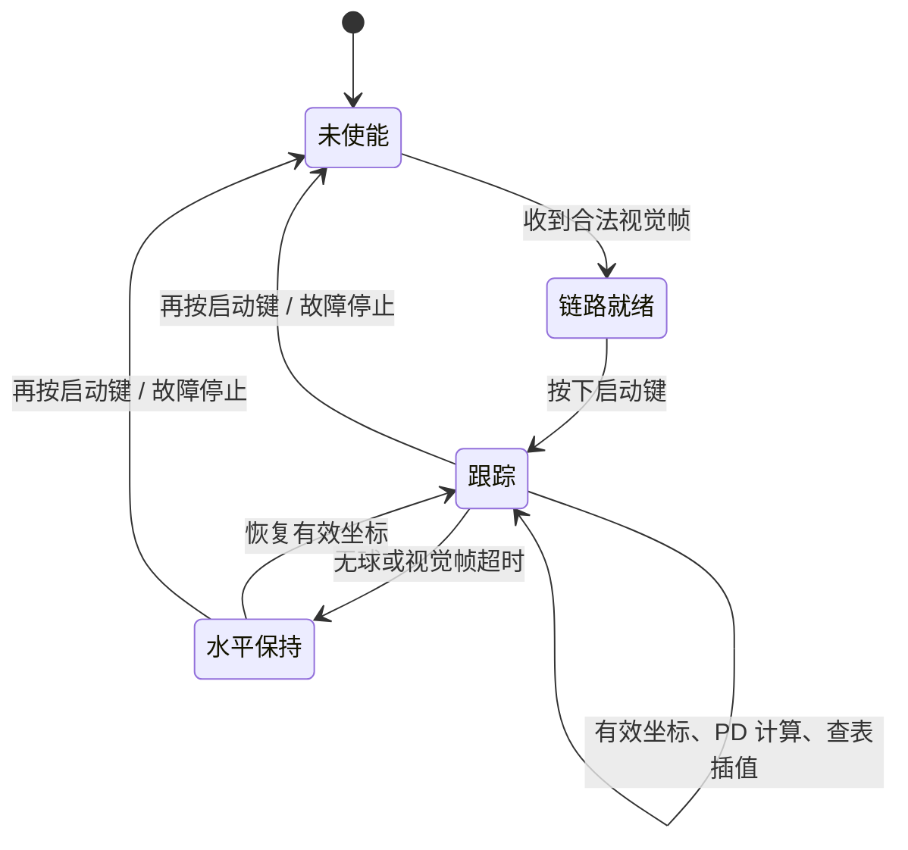
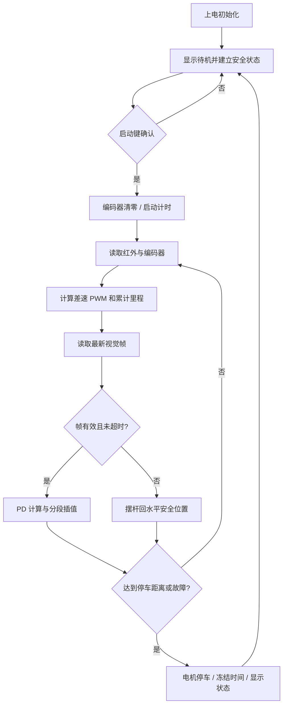

# 车载平衡滚球运动控制系统

## 摘要

针对车载平衡滚球运动控制任务，设计了一套集环形赛道循迹、定距停车、钢球视觉检测与摆杆调节于一体的控制系统。系统以 MSPM0G3507 为底盘控制核心，采用四路红外反射式传感器识别赛道黑线，结合双轮编码器分别估计左右轮里程；以车载 K230 视觉模块检测摆杆凹槽内钢球位置，并将有效坐标经串口发送至主控；主控根据钢球位置误差和速度估计输出摆杆目标角，再通过步进执行机构调节摆杆姿态。针对连杆机构传动比不恒定的问题，采用实测的“摆杆角度—相对步进脉冲”分段线性插值方法，避免直接以电机轴角度代替摆杆角度。现阶段已完成双轮编码器直线标定、摆杆空载标定和静止条件下的钢球 `0→+5→−5 cm` 闭环测试；联合循迹与平衡固件已完成静态回中、架空车轮 PWM 首测。整圈停车、落地联合运行及新版堵转诊断仍按测试方案继续验证，本文对已验证结果和待验证边界分别说明。

**关键词：** 车载平衡；红外循迹；双编码器；机器视觉；步进摆杆；分段标定

---

# 1 系统方案与方案论证

## 1.1 任务分析

系统需完成两类相互关联的运动控制任务：其一，小车沿黑色环形路线行驶一周，回到 A 点附近停车并显示总时间；其二，摆杆凹槽内的钢球在静止或行驶过程中保持在指定位置。为保证控制链路在车载端闭合，赛道循迹、轮速与里程估计、钢球位置检测和摆杆执行均由车载设备完成；场外视频链路仅承担观察、录像与回放，不参与控制决策。

环形路线由两段 1.5 m 直线和两个半径为 0.5 m 的半圆组成，其中心线一圈长度为：

$$
S=2\times1.5+2\pi\times0.5=6.1416\ \text{m}
$$

单纯依赖终点横线容易受传感器安装高度、赛道反光和横线覆盖宽度影响，因此本设计将红外传感器用于连续循迹，将双编码器里程作为停车主判据；最后一段降低车速，以减小惯性带来的停车误差。

## 1.2 总体方案

底盘控制层由 MSPM0G3507、双直流电机驱动、双轮编码器、四路红外反射传感器、启动按键和计时显示组成。视觉层由 K230 摄像头和钢球检测程序组成，只向主控传送经筛选和校验后的钢球横向坐标。执行层使用闭环步进电机、连杆机构和单端铰接摆杆，主控输出受限的目标位置脉冲。各模块的关系如图 1 所示。

图 1 系统总体框图

## 1.3 方案选择

### 1.3.1 循迹与停车方案

采用四路红外反射式传感器而非可见光灰度模块作为正式循迹输入。传感器输出构成赛道横向偏差的离散描述，控制器根据黑线相对车体中心的位置产生差速 PWM 指令。该方案结构简单、实时性高，且可由车载主控独立完成。

停车采用“循迹 + 编码器里程”组合策略。红外传感器保证车辆沿中心线行驶，左右编码器分别换算为轮程并取平均值作为累计行程。该策略避免了横线检测不稳定时的误停，也能将左右轮径差和速度差反映到里程估计中。

### 1.3.2 钢球检测与摆杆控制方案

钢球位置由固定在车体支架上的摄像头检测。相机完整覆盖 25 cm 摆杆凹槽，图像端仅输出钢球中心横坐标、检测有效标志、序号和置信度；主控不传输视频，也不依赖场外计算。为抑制背景与槽体边缘干扰，检测程序只保留凹槽感兴趣区域内的候选目标，并在多个候选框中选择置信度最高者。

摆杆采用单端铰接、另一端由步进电机连杆抬降的结构。由于电机轴转角与摆杆角度受连杆几何关系影响，并非恒定比例，控制器不使用单一“脉冲/度”常数，而是在已实测的相邻标定点之间进行线性插值。该方法能够兼顾当前机构的不对称传动特性与安全行程限制。

# 2 控制理论与关键计算

## 2.1 四路红外循迹与差速控制

四路红外传感器按车体横向从左至右布置。以黑线为低电平、白底为高电平为例，控制程序将原始状态映射为左偏、居中、右偏和严重偏离等类别。居中时两轮以基准占空比前进；检测到线偏向左侧时降低左轮或提高右轮占空比，使车辆向左修正；线偏向右侧时采用对称处理。偏差越大，内外轮 PWM 差越大，同时适当降低总占空比以提高曲线通过稳定性。

可将离散状态对应的横向误差记为 $e_l$，差速修正量为：

$$
u_l=K_l e_l
$$

$$
PWM_L=PWM_0-u_l,\qquad PWM_R=PWM_0+u_l
$$

其中，$PWM_0$ 为基准占空比，$K_l$ 为循迹增益。实际程序使用分段 PWM 表替代连续公式，以适配四路传感器的离散输出并限制急转弯时的最大占空比。

## 2.2 双编码器里程与减速停车

设左右轮累计脉冲数分别为 $N_L$、$N_R$，其标定系数分别为 $C_L$、$C_R$（单位为脉冲/cm），则左右轮程与车辆累计里程计算为：

$$
d_L=\frac{|N_L|}{C_L},\qquad d_R=\frac{|N_R|}{C_R},\qquad d=\frac{d_L+d_R}{2}
$$

当 $d$ 进入目标距离前的减速窗口时，车辆仍维持循迹，但将基准 PWM 降低；当 $d$ 达到目标距离时短刹停车并冻结总时间。若连续测试发现停车点位于 A 点之前，则增加目标里程；若越过 A 点，则减小目标里程。调整停车距离时不同时修改循迹参数，避免混淆距离误差与航向误差。

## 2.3 视觉坐标与串口数据链路

相机图像分辨率为 320×180。现场三点标定得到钢球位于 $-5$ cm、$0$ cm、$+5$ cm 时的完整画面横坐标分别为 84 px、149 px、208 px。因镜头安装与机构几何存在不对称，控制零点取实测的 149 px，而不取几何图像中心。钢球候选框中心横坐标为 $c_x$ 时，发送给主控的像素偏移量为：

$$
x_{px}=c_x-149
$$

负、正两侧实测比例分别为 13.0 px/cm 和 11.8 px/cm，因此位置换算采用分段关系：

$$
x_{cm}=\begin{cases}
x_{px}/13.0,&x_{px}<0\\
x_{px}/11.8,&x_{px}\geq0
\end{cases}
$$

据此，静止往返测试的目标分别设为 $+59$ px 和 $-65$ px。每个串口帧包含目标是否有效、递增序号、横向像素偏移和置信度，并带有异或校验。主控只保留最新一帧完整且校验正确的数据；当未检测到钢球或超过设定时间未收到有效帧时，控制器停止根据旧坐标继续调节，并命令摆杆回到已标定的水平位置。

## 2.4 摆杆 PD 控制与分段标定

主控以钢球目标位置 $x_{ref}$ 和测量位置 $x_{ball}$ 计算误差，并采用比例—微分控制生成摆杆目标角：

$$
e=x_{ref}-x_{ball}
$$

$$
\theta_{ref}=\operatorname{clamp}(K_p e-K_d\dot{x}_{ball},\theta_{min},\theta_{max})
$$

其中，速度项由相邻有效视觉帧的坐标差分并滤波得到。为防止小误差下频繁换向，在零点附近设置死区。目标角度 $\theta_{ref}$ 再由相邻实测标定点插值得到**相对**步进脉冲增量，增量限制在 $[-132,+132]$ 脉冲范围内，不对范围外角度进行外推。实际电机目标由“人工保存的水平参考位置 + 相对脉冲增量”构成，因此每次上电都必须重新调平并保存参考位置。

图 2 视觉—摆杆控制状态机

# 3 硬件与程序设计

## 3.1 硬件组成

底盘由双直流电机、TB6612 系列双路驱动和双相编码器构成。电机驱动的逻辑电源与主控使用 3.3 V 逻辑，电机电源与主控共地但独立供电。四路红外传感器使用 3.3 V 供电，避免 5 V 输出直接进入主控 GPIO。

摆杆部分由闭环步进电机、专用步进驱动器、连杆和单端铰接的 25 cm 凹槽摆杆组成。步进部分与车轮驱动分开供电和驱动，不能以直流电机桥替代步进驱动器。摆杆每次试验前在无球条件下人工调平并保存水平参考位置；运行过程中通过软件限制相对目标脉冲范围，防止连杆越界或机械干涉。

视觉模块与主控之间采用单向串口发送坐标，并与主控共地。视频图传与控制视觉分离：前者只负责场外实时观察与回放，后者只承担车载识球和坐标输出，避免无线链路参与控制闭环。

## 3.2 软件结构

主程序按周期执行输入采样、状态判断、控制计算和执行输出。静止控球程序以人工保存的水平位置为参考，依次执行 `0→+5 cm→−5 cm` 的目标切换；联合程序在第三次启动键确认时同时保存摆杆水平位置和当前钢球位置，随后以该位置作为本次运行的零点。底盘部分读取红外状态和编码器计数，采用“巡线 PD + S 曲线速度参考到开环 PWM”的候选策略：编码器用于测速、加速度前馈和异常检测，不参与车轮速度 PID。摆杆部分在收到新鲜且有效的钢球坐标后计算目标角与目标 POS；当视觉无效、串口校验失败或接收超时时，进入安全水平保持或故障停车状态。

图 3 系统主流程图

## 3.3 安全策略

1. 上电默认不驱动车轮和步进机构，必须由实体按键启动。
2. 视觉无效或通信超时后，摆杆不保持旧倾角，而是回到已标定的水平安全位置。
3. 摆杆的相对目标脉冲仅允许处于已标定区间；每次重新上电或改变机械安装后，都需要重新调平并保存水平参考位置。
4. 循迹丢失、编码器异常、运行超时或供电异常时，底盘立即停车，不继续盲目执行。
5. 所有首次电机测试均应在车轮悬空或预留安全距离的条件下进行；步进连杆先进行无球小范围验证，再进行实际钢球测试。

# 4 测试方案、阶段结果与分析

## 4.1 已完成的双编码器直线标定

在直线场地上，以同一车体参考点量取实际行驶距离，记录短刹后的左右编码器累计脉冲。两次原始数据见表 1。该测试仅用于建立左右轮里程换算关系，尚不等同于完整环形赛道的停车结果。

表 1 双编码器直线标定原始记录

| 次数 | 实际距离 / cm | 左轮脉冲 | 右轮脉冲 | 左轮脉冲/cm | 右轮脉冲/cm | 备注 |
|---:|---:|---:|---:|---:|---:|---|
| 1 | 97.0 | 6173 | 6072 | 63.64 | 62.60 | 低速直线短刹 |
| 2 | 96.5 | 6298 | 6054 | 65.26 | 62.74 | 低速直线短刹 |
| 合并标定 | 193.5 | 12471 | 12126 | **64.45** | **62.67** | 分别按总脉冲/总距离计算 |

由表 1 可知，左右轮的脉冲/厘米存在约 2.8% 的差异。若仅使用统一脉冲系数，将在长距离运行中累积成明显的里程偏差。因此后续整圈停车程序分别采用 $C_L=64.45$ 脉冲/cm、$C_R=62.67$ 脉冲/cm，再取两侧轮程平均值。两次测试均出现横向左偏现象，说明轮胎、车轮平行度、左右基础 PWM 或场地条件仍需独立复核，不能仅靠修改停车距离掩盖问题。

## 4.2 已完成的摆杆空载位置标定

在无钢球条件下，将摆杆固定测量点设在距离铰链中心 $L=25.8$ cm 处，零点高度为 $h_0=11.1$ cm。通过测量不同 POS 脉冲下的固定点高度，按下式换算白杆实测角度：

$$
\theta_{beam}=\arcsin\left(\frac{h-h_0}{25.8}\right)\times\frac{180}{\pi}
$$

表 2 摆杆角度—相对步进 POS 空载标定结果

| 相对 POS / 脉冲 | 固定点高度 / cm | 白杆实测角度 / ° | 电机轴显示角 / ° | 用途 |
|---:|---:|---:|---:|---|
| -132 | 10.1 | -2.221 | -14.8 | 负向限位标定点 |
| -88 | 10.5 | -1.333 | -9.8 | 负向中间点 |
| -44 | 10.9 | -0.444 | -4.9 | 负向中间点 |
| 0 | 11.1 | 0.000 | 0.0 | 水平零点 |
| +44 | 11.3 | +0.444 | +4.9 | 正向中间点 |
| +88 | 11.6 | +1.110 | +9.9 | 正向中间点 |
| +132 | 11.9 | +1.777 | +14.8 | 正向限位标定点 |

表 2 表明，电机轴显示角与摆杆实际角度不成固定比例，正、负方向的映射也不完全对称。因此控制程序只能在相邻标定点之间插值。例如白杆目标为 $+1.000°$ 时，应在 $(+0.444°,+44)$ 与 $(+1.110°,+88)$ 两点间插值，得到约 $+81$ 脉冲；不应直接以电机轴额定步距换算。

## 4.3 已完成的静止钢球闭环测试

静止测试采用三点视觉标定后的非对称目标：正端为 $+59$ px，负端为 $-65$ px。冻结参数下，已完成 `0→+5→−5 cm` 的现场验证；其中可追溯的详细记录为 `run_20260801_123833.csv`。该次任务有效动作时长为 1.75 s，小于 5 s；正端峰值为 $+66$ px，按正侧比例约为 $+5.6$ cm；负端停车时为 $-56$ px，停车后保持范围为 $-77$ px 至 $-56$ px，均落入 $-5\pm1$ cm 的像素容差范围。该记录未出现丢球样本或估算丢帧。

本次冻结的视觉 PD 参数为 $K_p=11$ mdeg/px、$K_d=1$ mdeg/(px/s)，积分项为 0；正向巡航角为 +800 mdeg，正端提前反向阈值为 +12 px，负向反向制动角为 +565 mdeg。上述参数仅对应本机构、当前相机标定和本次测试条件，后续复测前不自动改写。

表 3 静止 `0→+5→−5 cm` 闭环测试结果

| 指标 | 实测结果 | 判定说明 |
|---|---:|---|
| 有效动作时长 | 1.75 s | 小于 5 s |
| 正端峰值 | +66 px（约 +5.6 cm） | 位于 +5 cm 容差范围 |
| 负端停止后范围 | -77 px 至 -56 px | 位于 -5 cm 容差范围 |
| 丢球样本 / 估算丢帧 | 0 / 0 | 本次记录中未出现 |

该结果证明了当前视觉—摆杆闭环的方向、目标切换和末端保持策略在静止条件下可工作，但不代表行驶扰动下的平衡性能。后续重复测试应继续沿用冻结参数，并分别保存独立 CSV、参数文件和分析曲线。

## 4.4 联合固件阶段性验证

联合固件已进行两类低风险验证。第一类为 READY 状态下的静态回中：由 $+2.63$ cm 扰动回到并连续保持在 $\pm1$ cm 内约需 1.10 s，末段 1 s 最大误差为 0.31 cm，未出现视觉陈旧样本或故障。第二类为车轮悬空 PWM 首测：左右轮约在 5% 与 6% PWM 时开始产生方向正确的负向编码器计数，PWM 按 1%/20 ms 平滑上升，运行段钢球最大误差为 0.54 cm。

架空首测的旧堵转逻辑在低速时因单个 20 ms 周期内无编码器跳变而误报故障，故该次联合运行不能作为行驶性能结论。诊断已改为：当 PWM 达到阈值后，在完整 500 ms 窗口内分别检查左右轮累计计数；修正版尚待独立架空复测。联合程序的 5 cm/s 巡航上限、巡线参数和加速度前馈系数仍均为候选值，尚未进行落地循迹。

## 4.5 待联调项目与验收记录表

下列项目尚未获得可用于最终性能结论的完整实测记录。为避免将设计目标误作测试结果，正式联调时应逐次填写表 4，并保留原始照片、视频或串口记录。

表 4 整机联调与验收记录表

| 项目 | 测试条件与方法 | 关键记录 | 当前状态 |
|---|---|---|---|
| LF04 循迹 | 逐路在黑线、白底上确认极性和物理顺序；随后低速跑直线与半圆 | 各路原始状态、丢线次数、通过次数 | 待实测 |
| 环形 A 点停车 | 从 A 点出发，按 614.16 cm 初始目标跑完整圈，至少连续测试 5 次 | 左右脉冲、总时间、相对 A 点偏差、停车航向 | 待实测 |
| K230 串口链路 | 固定坐标帧、ROI 内左右移动和断线超时分别测试 | 合法帧率、序号连续性、校验失败数、超时次数 | 静止闭环已验证；脱机自启动待复核 |
| 静止控球 | 依次执行 $O\rightarrow+5$ cm、$+5\rightarrow-5$ cm | 两端最大误差、稳定时间、总时间、是否掉球 | 已有通过记录，继续复测 |
| 行驶控球 | 环形赛道运行时开启视觉—摆杆闭环 | 全过程最大误差、掉球次数、视频回放 | 待实测 |

## 4.6 阶段分析

目前已形成底盘的双编码器里程基准、摆杆相对位置标定和非对称视觉位置标定；静止钢球闭环已获得通过记录，联合程序也完成了静态与架空初测。现有数据仍不足以证明整机已达到环形停车或行驶平衡性能要求：直线标定不能代替曲线路段的轮程验证，架空 PWM 不能代替落地循迹，静止闭环也不能代替车辆加减速扰动下的钢球控制。下一阶段应先按修正版堵转诊断完成独立架空复测，再进行低速短直线基线；每次只改变 PWM 上限、映射斜率或前馈参数中的一项，并保存 CSV、参数文件和分析曲线。

# 5 结论

本文提出了车载平衡滚球运动控制系统的总体方案。系统以红外反射传感器实现环形路线循迹，以双编码器的独立轮程换算实现定距停车，以车载视觉实现钢球位置检测，并以 PD 控制和摆杆角度—相对 POS 分段插值完成摆杆执行控制。当前已完成左右编码器直线标定，得到左轮 64.45 脉冲/cm、右轮 62.67 脉冲/cm；完成了 $-2.221°$ 至 $+1.777°$ 范围内的摆杆空载标定，以及静止条件下 `0→+5→−5 cm` 的闭环通过记录。联合循迹与平衡程序已经完成静态回中和架空 PWM 首测，但尚未获得落地整圈、停车偏差和行驶全过程钢球误差的正式数据。后续仍以连续整圈停车偏差、钢球全过程最大位置误差、稳定时间、掉球情况和场外视频回放作为整机验收依据。

---

## 附：提交排版时的保留位置

1. 首页标题、摘要、关键词之外不放学校、队伍编号、姓名、二维码或其他识别信息。
2. 每页顶部保留不小于 3 cm 的空白区域；正文采用小四宋体、22 磅固定行距，页码置于右下角。
3. 图 1 至图 3 可按本稿 Mermaid 图重绘为黑白框图；补充实车照片时应优先替换示意图，而非增加冗余页面。
4. 表 4 中的“待实测”必须在取得原始证据后再改为具体结果；未完成的项目不填预期数据。
